# Jarkom-Modul-3-A14-2023
## 1 Lakukan Konfigurasi sesuai dengan topologi yang diberikan
Pertama, buat topologi tersebut kemudian set konfigurasi setiap nodenya sebagai berikut  
<b>Aura</b>
```
auto eth0
iface eth0 inet dhcp
Ip iptables -t nat -A POSTROUTING -o eth0 -j MASQUERADE -s 10.6.0.0/16

auto eth1
iface eth1 inet static
	address 10.6.1.0
	netmask 255.255.255.0

auto eth2
iface eth2 inet static
	address 10.6.2.0
	netmask 255.255.255.0

auto eth3
iface eth3 inet static
	address 10.6.3.0
	netmask 255.255.255.0

auto eth4
iface eth4 inet static
	address 10.6.4.0
	netmask 255.255.255.0
```

<b>Himmel</b>
```
auto eth0
iface eth0 inet static
	address 10.6.1.1
	netmask 255.255.255.0
	gateway 10.6.1.0
```

<b>Heiter</b>
```
auto eth0
iface eth0 inet static
	address 10.6.1.2
	netmask 255.255.255.0
	gateway 10.6.1.0
```

<b>Denken</b>
```
auto eth0
iface eth0 inet static
	address 10.6.2.2
	netmask 255.255.255.0
	gateway 10.6.2.0
```

<b>Eisen</b>
```
auto eth0
iface eth0 inet static
	address 10.6.2.1
	netmask 255.255.255.0
	gateway 10.6.2.0
```

<b>Frieren</b>
```
auto eth0
iface eth0 inet static
	address 10.6.4.3
	netmask 255.255.255.0
	gateway 10.6.4.0
```

<b>Flamme</b>
```
auto eth0
iface eth0 inet static
	address 10.6.4.2
	netmask 255.255.255.0
	gateway 10.6.4.0
```

<b>Fern</b>
```
auto eth0
iface eth0 inet static
	address 10.6.4.1
	netmask 255.255.255.0
	gateway 10.6.4.0
```

<b>Lawine</b>
```
auto eth0
iface eth0 inet static
	address 10.6.3.3
	netmask 255.255.255.0
	gateway 10.6.3.0
```

<b>Linie</b>
```
auto eth0
iface eth0 inet static
	address 10.6.3.2
	netmask 255.255.255.0
	gateway 10.6.3.0
```

<b>Lugner</b>
```
auto eth0
iface eth0 inet static
	address 10.6.3.1
	netmask 255.255.255.0
	gateway 10.6.3.0
```

<b>Revolte</b>
```
auto eth0
iface eth0 inet dhcp
```

<b>Richter</b>
```
auto eth0
iface eth0 inet dhcp
```

<b>Sein</b>
```
auto eth0
iface eth0 inet dhcp
```

<b>Stark</b>
```
auto eth0
iface eth0 inet dhcp
```

<hr></hr>  

## Semua Client harus menggunakan konfigurasi dari DHCP Server
<b>Aura</b>
```
iptables -t nat -A POSTROUTING -o eth0 -j MASQUERADE -s 10.6.0.0/16
```
Jalankan kedua perintah ini untuk membuat semua node lainnya dapat mengakses NAT

```
apt-get update
apt-get install isc-dhcp-relay -y
```
Install relay untuk dhcp

```
echo 'SERVERS="10.6.1.1"
INTERFACES="eth1 eth2 eth3 eth4"
OPTIONS=""
' > /etc/default/isc-dhcp-relay
```
Set nilai SERVERS menjadi IP dari DHCP server, kemudian INTERFACES sebagai sambungan koneksi ethernet yang dimiliki oleh server DHCP relay

```
echo 'net.ipv4.ip_forward=1' > /etc/sysctl.conf
```
Buat agar request DHCP dapat diforward dari client menuju DHCP server, dan sebaliknya

```
service isc-dhcp-relay start
```
Mulai service DHCP relay

<b>Himmel</b>
```
echo 'nameserver 192.168.122.1' > /etc/resolv.conf
```
Digunakan untuk membuat Himmel bisa terkoneksi dengan internet

```
apt-get update
apt-get install isc-dhcp-server -y
```
Install server DHCP

```
echo 'DHCPDv4_PID=/var/run/dhcpd.pid
INTERFACESv4="eth0"' > /etc/default/isc-dhcp-server

echo 'option domain-name "example.org";
option domain-name-servers ns1.example.org, ns2.example.org;

default-lease-time 600;
max-lease-time 7200;

ddns-update-style none;

authoritative;

subnet 10.6.1.0 netmask 255.255.255.0{
}
subnet 10.6.2.0 netmask 255.255.255.0{
}
subnet 10.6.3.0 netmask 255.255.255.0 {
}
subnet 10.6.4.0 netmask 255.255.255.0 {
}
' > /etc/dhcp/dhcpd.conf
```
Set up server DHCP untuk menangani DHCP request

<hr></hr>  

## 2 Client yang melalui Switch3 mendapatkan range IP dari 10.6.3.16 - 10.6.3.32 dan 10.6.3.64 - 10.6.3.80
<b>Himmel</b>
```
subnet 10.6.3.0 netmask 255.255.255.0 {
    range 10.6.3.16 10.6.3.32;
    range 10.6.3.64 10.6.3.80;
    option routers 10.6.3.0;
    option broadcast-address 10.6.3.255;
}
```
Ubah bagian ```subnet 10.6.3.0 netmask 255.255.255.0 {}``` pada file <b>/etc/dhcp/dhcpd.conf</b> untuk mengatur cara DHCP server menangani request DHCP dari subnet 10.6.3.0 Disini mereka akan diberikan ip 10.6.3.16 - 10.6.3.32, atau 10.6.3.64 - 10.6.3.80. Router dari subnet tersebut adalah 10.6.3.0

<hr></hr>  

## 3 Client yang melalui Switch4 mendapatkan range IP dari 10.6.4.12 - 10.6.4.20 dan 10.6.4.160 - 10.6.4.168
<b>Himmel</b>
```
subnet 10.6.4.0 netmask 255.255.255.0 {
    range 10.6.4.12 10.6.4.20;
    range 10.6.4.160 10.6.4.168;
    option routers 10.6.4.0;
    option broadcast-address 10.6.4.255;
}
```
Ubah bagian ```subnet 10.6.4.0 netmask 255.255.255.0 {}``` pada file <b>/etc/dhcp/dhcpd.conf</b> untuk mengatur cara DHCP server menangani request DHCP dari subnet 10.6.4.0 Disini mereka akan diberikan ip 10.6.4.12 - 10.6.4.20, atau 10.6.4.160 - 10.6.4.168. Router dari subnet tersebut adalah 10.6.4.0

<hr></hr>  

## 4 Client mendapatkan DNS dari Heiter dan dapat terhubung dengan internet melalui DNS tersebut
<b>Himmel</b>
```
    option domain-name-servers 10.6.1.2;
```
Tambahkan baris tersebut kedalam fungsi ```subnet 10.6.3.0 netmask 255.255.255.0 {}``` dan ```subnet 10.6.4.0 netmask 255.255.255.0 {}``` pada file <b>/etc/dhcp/dhcpd.conf</b> sehingga mereka akan menggunakan DNS dari server dengan IP 10.6.1.2 (Heiter)

<hr></hr>

## 5 Lama waktu DHCP server meminjamkan alamat IP kepada Client yang melalui Switch3 selama 3 menit sedangkan pada client yang melalui Switch4 selama 12 menit. Dengan waktu maksimal dialokasikan untuk peminjaman alamat IP selama 96 menit
<b>Himmel</b>
```
    default-lease-time 180;
    max-lease-time 5760;
```
Tambahkan baris tersebut kedalam fungsi ```subnet 10.6.3.0 netmask 255.255.255.0 {}``` pada file <b>/etc/dhcp/dhcpd.conf</b> sehingga mereka akan memiliki waktu peminjaman secara default selama 180 detik (3 menit) dan waktu peminjaman maksimal 5760 detik (96 menit)

```
    default-lease-time 720;
    max-lease-time 5760;
```
Tambahkan baris tersebut kedalam fungsi ```subnet 10.6.4.0 netmask 255.255.255.0 {}``` pada file <b>/etc/dhcp/dhcpd.conf</b> sehingga mereka akan memiliki waktu peminjaman secara default selama 720 detik (12 menit) dan waktu peminjaman maksimal 5760 detik (96 menit)


<hr></hr>  

## 6 Pada masing-masing worker PHP, lakukan konfigurasi virtual host untuk website berikut dengan menggunakan php 7.3

Masukkan kode berikut pada masing-masing Worker PHP (Lugner, Line, dan Lagwine)
```bash
cd root
echo 'nameserver 192.168.122.1' > /etc/resolv.conf
apt-get update
apt-get install wget unzip php7.3 php7.3-fpm nginx -y
wget -O file.zip "https://drive.google.com/uc?export=download&id=1ViSkRq7SmwZgdK64eRbr5Fm1EGCTPrU1"
unzip file.zip
mv modul-3 /var/www/granz.channel.a14
rm file.zip
echo 'server {
	listen 80;

	root /var/www/granz.channel.a14;

	index index.php index.html index.htm;
	server_name granz.channel.a14.com;

	location / {
			try_files $uri $uri/ /index.php?$query_string;
	}

	# pass PHP scripts to FastCGI server
	location ~ \.php$ {
		include snippets/fastcgi-php.conf;
		fastcgi_pass unix:/var/run/php/php7.3-fpm.sock;
	}

	location ~ /\.ht {
		deny all;
	}
	error_log /var/log/nginx/jarkom_error.log;
	access_log /var/log/nginx/jarkom_access.log;
}' > /etc/nginx/sites-available/granz.channel.a14
rm -rf /etc/nginx/sites-enabled/default
ln -s /etc/nginx/sites-available/granz.channel.a14 /etc/nginx/sites-enabled
service nginx start
service php7.3-fpm start
```

Lalu pada Load Balancer tambahkan kode berikut pada file `/etc/nginx/sites-available/default`
```bash
server {
	listen 80;
	server_name granz.channel.a14.com;

	location / {
		proxy_pass http://myweb;
	}
}

```

<hr></hr>  

## 7.) Kepala suku dari Bredt Region memberikan resource server sebagai berikut:
###	Lawine, 4GB, 2vCPU, dan 80 GB SSD.
###	Linie, 2GB, 2vCPU, dan 50 GB SSD.	
###	Lugner 1GB, 1vCPU, dan 25 GB SSD.
### Aturlah agar Eisen dapat bekerja dengan maksimal, lalu lakukan testing dengan 1000 request dan 100 request/second

Disini kami menggunakan algoritma Weighted Least Connection dengan perbandingan sebagai berikut :

	Lawine = 4
	Linie = 2
	Lugner = 1

Dengan cara hanya menambahkan script berikut pada Load Balancer (Eisen) di folder `etc/nginx/sites-enabled/default` : 
```bash
upstream myweb  {
        least_conn;
        server 10.6.3.1 weight=1;
        server 10.6.3.2 weight=4;
        server 10.6.3.3 weight=8;
}
```

Dan berikut adalah hasilnya dengan didapatkannya 2659.54 request/second

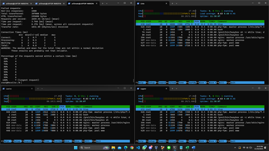


<hr></hr>  

## 8 Karena diminta untuk menuliskan grimoire, buatlah analisis hasil testing dengan 200 request dan 10 request/second masing-masing algoritma Load Balancer dengan ketentuan sebagai berikut:
### a) Nama Algoritma Load Balancer
### b) Report hasil testing pada Apache Benchmark
### c) Grafik request per second untuk masing masing algoritma. 
### d) Analisis

1.) Algoritma Weighted Round Robin

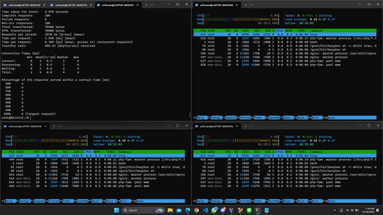

Didapatkan hasil 2570.66 Request/Second

2.) Algoritma Weighted Least Connection

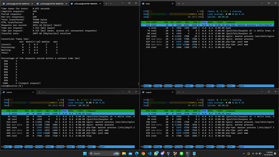

Didapatkan hasil 2831.10 Request/Second

3.) Algoritma IP Hash


Didapatkan hasil 2525.06 Request/Second

4.) Algoritma Generic Hash


Didapatkan hasil 2601.12 Request/Second

Grafik perbandingan algoritma


Hasil analisisnya adalah Dilihat dari grafik Request per Second yang didapatkan, algoritma yang paling baik adalah Least Connection yang dapat menerima 2831.10 Request per Detik. Hal ini dikarenakan algoritma tersebut memperhatikan request yang diterima setiap worker.

<hr></hr> 

## 9 Dengan menggunakan algoritma Round Robin, lakukan testing dengan menggunakan 3 worker, 2 worker, dan 1 worker sebanyak 100 request dengan 10 request/second, kemudian tambahkan grafiknya pada grimoire

1.) 3 Worker


Didapatkan 352.48 Request/Second

2.) 2 Worker


Didapatkan 355.21 Request/Second

3.) 1 Worker


Didapatkan 289.00 Request/Second

Grafik Perbandingan Worker


Hasil analisisnya adalah semakin banyak jumlah workernya, maka semakin kecil waktu yang diperlukan untuk memproses request, meski juga ada terdapat batas atas dari jumlah worker yang akan memberikan pengaruh. Hal ini disebabkan bahwa dengan worker yang lebih banyak maka pembagian jumlah request yang harus dikerjakan setiap worker akan menurun namun worker yang terlalu banyak tidak akan memberi efek yang terlalu berarti bagi performa load balancer


<hr></hr>  

## 10 Selanjutnya coba tambahkan konfigurasi autentikasi di LB dengan dengan kombinasi username: “netics” dan password: “ajkyyy”, dengan yyy merupakan kode kelompok. Terakhir simpan file “htpasswd” nya di /etc/nginx/rahasisakita/

Untuk menambahkan konfigurasi autentikasi dapat menambahkan command berikut

```bash
apt-get install apache2-utils
mkdir /etc/nginx/rahasiakita
htpasswd -c -b /etc/nginx/rahasiakita/.htpasswd netics ajka14
```

Lalu tambahkan konfigurasi berikut pada file ```/etc/nginx/sites-available/default```
```bash
location / {
	auth_basic "Restricted Area";
	auth_basic_user_file /etc/nginx/rahasiakita/.htpasswd;
	proxy_pass http://myweb;
}
```

<hr></hr>  

## 11 Lalu buat untuk setiap request yang mengandung /its akan di proxy passing menuju halaman https://www.its.ac.id.
Tambahkan konfigurasi berikut dalam file ```/etc/nginx/sites-available/default```
```bash
location /its {
	proxy_pass https://www.its.ac.id;
}
```
<hr></hr>

## 12 Selanjutnya LB ini hanya boleh diakses oleh client dengan IP 10.6.3.69, 10.6.3.70, 10.6.4.167, dan 10.6.4.168.
Tambahkan konfigurasi berikut agar yang dapat mengakses adalah IP 10.6.3.69, 10.6.3.70, 10.6.4.167, dan 10.6.4.168 dan memblokir segala request selain IP tersebut pada file ```/etc/nginx/sites-available/default```

```bash
allow 10.6.3.69;
allow 10.6.3.70;
allow 10.6.4.167;
allow 10.6.4.168;
deny all;
```

<hr></hr>  

## 13 Semua data yang diperlukan, diatur pada Denken dan harus dapat diakses oleh Frieren, Flamme, dan Fern

Konfigurasi Database pada Database Server (Denke) dengan kode berikut

1.) Konfigurasi Untuk Install MySql

```bash
echo 'nameserver 192.168.122.1' > /etc/resolv.conf
apt-get update
apt-get install mariadb-server -y
service mysql start
```
2.) Konfigurasi MySql
```bash
mysql -u root -e "CREATE DATABASE db_frieren"
mysql -u root -e "CREATE USER 'a14'@'%' IDENTIFIED BY 'a14'"
mysql -u root -e "GRANT ALL PRIVILEGES ON * . * TO a14@'%'"
mysql -u root -e "FLUSH PRIVILEGES"
echo '
[client-server]
[mysqld]
skip-networking=0
skip-bind-address
!includedir /etc/mysql/conf.d/
!includeidr /etc/mysql/mariadb.conf.d/
' > /etc/mysql/my.cnf
echo '[server]
[mysqld]
user            = mysql
pid-file        = /var/run/mysqld/mysqld.pid
socket          = /var/run/mysqld/mysqld.sock
port            = 3306
basedir         = /usr
datadir         = /var/lib/mysql
tmpdir          = /tmp
lc-messages-dir = /usr/share/mysql
skip-external-locking
bind-address            = 0.0.0.0
key_buffer_size         = 16M
max_allowed_packet      = 16M
thread_stack            = 192K
thread_cache_size       = 8
myisam-recover         = BACKUP
query_cache_limit       = 1M
query_cache_size        = 16M
log_error = /var/log/mysql/error.log
expire_logs_days        = 10
max_binlog_size   = 100M
character-set-server  = utf8mb4
collation-server      = utf8mb4_general_ci
[embedded]
[mariadb]
[mariadb-10.0]
' > /etc/mysql/mariadb.conf.d/50-server.cnf
service mysql restart
```

Lalu install mariadb-client pada client
```bash
apt-get update
apt-get install mariadb-client
```

Lalu jalankan MySql pada client
```bash
mysql
```

<hr></hr>  

## 14 Frieren, Flamme, dan Fern memiliki Riegel Channel sesuai dengan quest guide berikut. Jangan lupa melakukan instalasi PHP8.0 dan Composer 

Pada masing-masing Laravel Worker, konfigurasi webserver Laravel dengan konfigurasi berikut


```bash
echo 'nameserver 192.168.122.1' > /etc/resolv.conf
apt-get update
apt-get install lsb-release ca-certificates apt-transport-https software-properties-common gnupg2 -y
curl -sSLo /usr/share/keyrings/deb.sury.org-php.gpg https://packages.sury.org/php/apt.gpg
sh -c 'echo "deb [signed-by=/usr/share/keyrings/deb.sury.org-php.gpg] https://packages.sury.org/php/ $(lsb_release -sc) main" > /etc/apt/sources.list.d/php.list'

apt-get update
apt-get install php8.0-mbstring php8.0-xml php8.0-cli php8.0-common php8.0-intl php8.0-opcache php8.0-readline php8.0-mysql php8.0-fpm php8.0-curl unzip wget -y
apt-get install nginx -y

```
Install `Composer` dan `Git`
```bash
wget https://getcomposer.org/download/2.0.13/composer.phar
chmod +x composer.phar
mv composer.phar /usr/bin/composer
apt-get install git -y
```
Clone Git Repository kedalam `var/www`
```bash
rm -rf /var/www/laravel-praktikum-jarkom
cd /var/www
git clone https://github.com/martuafernando/laravel-praktikum-jarkom.git
cd laravel-praktikum-jarkom
```
Update composer dan buat file `.env` dengan isi konfigurasinya
```bash
composer update
touch .env

echo 'APP_NAME=Laravel
APP_ENV=local
APP_KEY=
APP_DEBUG=true
APP_URL=http://localhost

LOG_CHANNEL=stack
LOG_DEPRECATIONS_CHANNEL=null
LOG_LEVEL=debug

DB_CONNECTION=mysql
DB_HOST=10.6.2.2
DB_PORT=3306
DB_DATABASE=db_frieren
DB_USERNAME=a14
DB_PASSWORD=a14

BROADCAST_DRIVER=log
CACHE_DRIVER=file
FILESYSTEM_DISK=local
QUEUE_CONNECTION=sync
SESSION_DRIVER=file
SESSION_LIFETIME=120

MEMCACHED_HOST=127.0.0.1

REDIS_HOST=127.0.0.1
REDIS_PASSWORD=null
REDIS_PORT=6379

MAIL_MAILER=smtp
MAIL_HOST=mailpit
MAIL_PORT=1025
MAIL_USERNAME=null
MAIL_PASSWORD=null
MAIL_ENCRYPTION=null
MAIL_FROM_ADDRESS="hello@example.com"
MAIL_FROM_NAME="${APP_NAME}"

AWS_ACCESS_KEY_ID=
AWS_SECRET_ACCESS_KEY=
AWS_DEFAULT_REGION=us-east-1
AWS_BUCKET=
AWS_USE_PATH_STYLE_ENDPOINT=false

PUSHER_APP_ID=
PUSHER_APP_KEY=
PUSHER_APP_SECRET=
PUSHER_HOST=
PUSHER_PORT=443
PUSHER_SCHEME=https
PUSHER_APP_CLUSTER=mt1

VITE_PUSHER_APP_KEY="${PUSHER_APP_KEY}"
VITE_PUSHER_HOST="${PUSHER_HOST}"
VITE_PUSHER_PORT="${PUSHER_PORT}"
VITE_PUSHER_SCHEME="${PUSHER_SCHEME}"
VITE_PUSHER_APP_CLUSTER="${PUSHER_APP_CLUSTER}"
' > .env
php artisan migrate:fresh --seeder=AiringsTableSeeder
php artisan key:generate
php artisan jwt:secret # Tambahkan kode apabila ada error secret key

```
Setup Laravel Webservernya
```bash
cd /root
echo 'server {

    listen 80;

    root /var/www/laravel-praktikum-jarkom/public;

    index index.php index.html index.htm;
    server_name _;

    location / {
            try_files $uri $uri/ /index.php?$query_string;
    }

    # pass PHP scripts to FastCGI server
    location ~ \.php$ {
    include snippets/fastcgi-php.conf;
    fastcgi_pass unix:/var/run/php/php8.0-fpm.sock;
    }

location ~ /\.ht {
            deny all;
    }

    error_log /var/log/nginx/praktikum-jarkom_error.log;
    access_log /var/log/nginx/praktikum-jarkom_access.log;
}' > /etc/nginx/sites-available/praktikum-jarkom

ln -s /etc/nginx/sites-available/praktikum-jarkom /etc/nginx/sites-enabled/
rm /etc/nginx/sites-enabled/default
chown -R www-data.www-data /var/www/laravel-praktikum-jarkom/storage

service php8.0-fpm start
service nginx restart
```

Lalu pada Load Balancer (Eisen) Tambahkan code berikut pada file `/etc/nginx/sites-available/riegel.canyon.a14`

```bash
echo 'upstream laravelweb {
	server 10.6.4.1;
	server 10.6.4.2;
	server 10.6.4.3;
}

server {
	listen 80;
	server_name riegel.canyon.a14.com;

	location / {
		proxy_pass http://laravelweb;
	}
}' > /etc/nginx/sites-available/riegel.canyon.a14

ln -s /etc/nginx/sites-available/riegel.canyon.a14 /etc/nginx/sites-enabled
service nginx restart
```

<hr></hr>  

## Riegel Channel memiliki beberapa endpoint yang harus ditesting sebanyak 100 request dengan 10 request/second. Tambahkan response dan hasil testing pada grimoire
## 15 POST /auth/register
Untuk menguji dapat menggunakan command berikut
```bash
curl -X POST riegel.canyon.a14.com/api/auth/register -H 'Content-Type: application/json' -d '{"username": "username", "password": "password"}'
```
Dan berikut adalah hasilnya

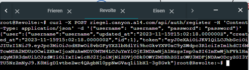
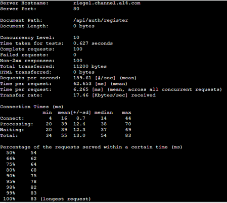
## 16 POST /auth/login
Untuk menguji dapat menggunakan command berikut
```bash
curl -X POST riegel.canyon.a14.com/api/auth/login -H 'Content-Type: application/json' -d '{"username": "username", "password": "password"}'
```
Dan berikut adalah hasilnya

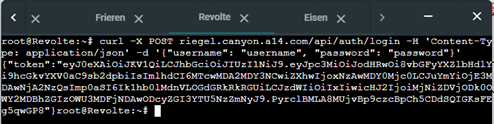
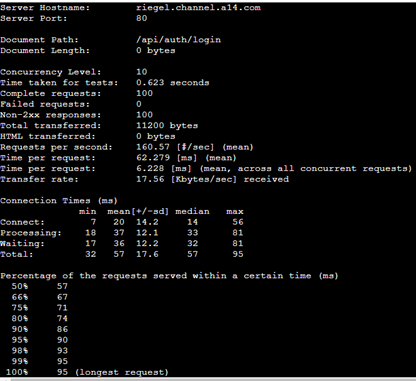
## 17 GET /me
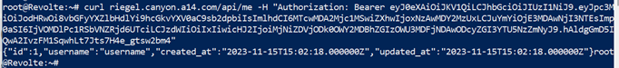
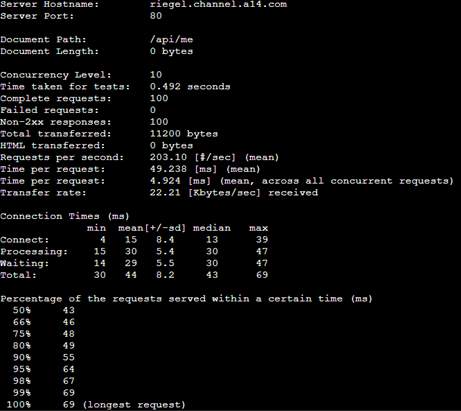

<hr></hr>  

## 18 Untuk memastikan ketiganya bekerja sama secara adil untuk mengatur Riegel Channel maka implementasikan Proxy Bind pada Eisen untuk mengaitkan IP dari Frieren, Flamme, dan Fern

Pada Load Balancer, tambahkan konfigurasi berikut pada file `/etc/nginx/sites-available/riegel.canyon.a14`

```bash
server {
	listen 80;
	server_name riegel.canyon.a14.com;

	location / {
		proxy_pass http://laravelweb;
		proxy_bind 10.6.2.1;
	}
	location /fern/ {
		proxy_bind 10.6.2.1;
		proxy_pass http://10.6.4.1/;
	}
	location /flamme/ {
		proxy_bind 10.6.2.1;
		proxy_pass http://10.6.4.2/;
	}
	location /frieren/ {
		proxy_bind 10.6.2.1;
		proxy_pass http://10.6.4.3/;
	}
}

```

<hr></hr>  

## 19 Untuk meningkatkan performa dari Worker, coba implementasikan PHP-FPM pada Frieren, Flamme, dan Fern. Untuk testing kinerja naikkan 
### - pm.max_children
### - pm.start_servers
### - pm.min_spare_servers
### - pm.max_spare_servers
### sebanyak tiga percobaan dan lakukan testing sebanyak 100 request dengan 10 request/second kemudian berikan hasil analisisnya pada Grimoire

Untuk menguji kita ubah isi file pada ```/etc/php/8.0/fpm/pool.d/www.conf``` menjadi seperti berikut 
```bash
[www]
user = www-data
group = www-data
listen = /run/php/php8.0-fpm.sock
listen.owner = www-data
listen.group = www-data
pm = dynamic
pm.max_children = 75
pm.start_servers = 10
pm.min_spare_servers = 5
pm.max_spare_servers = 20
```
Dan ganti atribut ***pm*** 
Lalu jangan lupa restart dan jalankan Apache Benchmark

```bash
service php8.0-fpm restart
ab -n 100 -c 10 http://riegel.canyon.a14.com/
```

Dan berikut adalah hasilnya

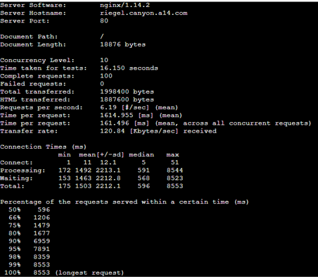
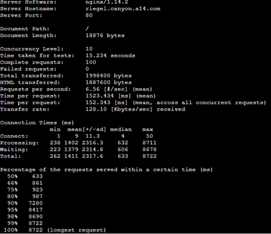
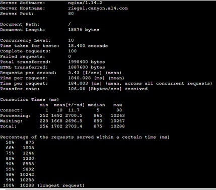

<hr></hr>  

## 20 Nampaknya hanya menggunakan PHP-FPM tidak cukup untuk meningkatkan performa dari worker maka implementasikan Least-Conn pada Eisen. Untuk testing kinerja dari worker tersebut dilakukan sebanyak 100 request dengan 10 request/second.

Tambahkan konfigurasi di Load Balancer (Eisen) pada file berikut `/etc/nginx/sites-available/riegel.canyon.a14`
```bash
upstream laravelweb {
	least_conn;
	server 10.6.4.1;
	server 10.6.4.2;
	server 10.6.4.3;
}
```

Dan berikut adalah hasilnya

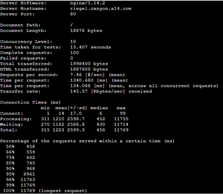